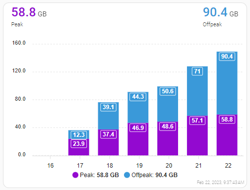

[](https://github.com/hacs/default)
[](https://github.com/myTselection/telenet_telemeter/releases)


[](https://github.com/myTselection/telenet_telemeter/issues)
[](https://github.com/myTselection/telenet_telemeter/commits/main)
[](https://github.com/myTselection/telenet_telemeter/graphs/commit-activity)


# Telenet / BASE Telemeter Home Assistant integration
[Telenet Telemeter](https://www2.telenet.be/nl/business/klantenservice/raadpleeg-uw-internetverbruik/) Home Assistant custom component also supporting [BASE Telemeter](https://www.base.be/nl/klantenzone/internet/je-internetverbruik.html). This custom component brings your Telenet & BASE internet and mobile usage details into Home Assistant. This integration is built against the public API used by the Telenet web app and has not been tested for any other countries. BASE is owned by Telenet and uses similar tools, so both products are supported since release 3.0.

This integration is in no way affiliated with Telenet Belgium.
| :warning: Please don't report issues with this integration to Telenet, they will not be able to support you. |
| --- |

Some discussion on this topic can be found on the [Home Assistant Forum](https://community.home-assistant.io/t/telenet-telemeter-isp-monthly-data-usage/444810).

Originally based on the Python application by [Killian Meersman](https://github.com/KillianMeersman/telemeter).
<p align="left"></p>

## Installation
- [HACS](https://hacs.xyz/): search for **Telenet Telemeter** in HACS integrations and install
  - [](https://my.home-assistant.io/redirect/hacs_repository/?owner=myTselection&repository=telenet_telemeter&category=integration)
- Restart Home Assistant
- Add **Telenet Telemeter** via HA Settings → Devices & Services → Integrations
- Provide your Telenet, Telenet Business or BASE username and password

---

## Sensors

### Internet — `sensor.telenet_internet_<label>_<id>`

**State:** data used in **GB** (FUP counter for TURBO/FUP plans; CAP plans show GB consumed of allocated cap).

| Attribute | Description | Example |
|---|---|---|
| `usage_gb` | Data used this period (FUP counter) | `268.61` |
| `peak_usage_gb` | Peak traffic downloaded (GB) | `266.75` |
| `offpeak_usage_gb` | Off-peak traffic downloaded (GB) | `805.51` |
| `total_downloaded_gb` | Peak + off-peak total downloaded (GB) | `1072.26` |
| `used_percentage` | % of cap used (CAP plans) | `27.3` |
| `period_days_left` | Days remaining in billing period | `10.1` |
| `period_next_start` | Date the next period begins | `2026-06-12` |
| `last_update_formatted` | Human-readable last update time | `22:06 on 1 Jun` |
| `period_start` | Period start date/time | `2026-05-12` |
| `period_end` | Period end date/time | `2026-06-11` |
| `period_used_percentage` | % of billing period elapsed | `64.3` |
| `total_volume` | Total cap in GB (CAP plans) | `300` |
| `download_speed` | Contracted download speed | `1 Gbps` |
| `upload_speed` | Contracted upload speed | `50 Mbps` |
| `wifiEnabled` | Modem Wi-Fi enabled | `true` |
| `product` | Product label key | `turbo` |

> **FUP / TURBO plans:** only **peak** traffic counts towards the FUP service limit (e.g. 3 TB). Off-peak traffic is free. The sensor state uses `productUsage.totalUsage.units` — the same counter the Telenet app shows.

---

### Peak indicator — `sensor.telenet_peak_<label>_<id>`

Binary sensor (`on` = peak hours active). Attributes include `peak_usage`, `offpeak_usage`, `used_percentage`, `download_speed`, `squeezed`.

---

### Mobile — `sensor.telenet_mobile_<plan>_<msisdn>`

**State:** data used in **GB**.

| Attribute | Description | Example |
|---|---|---|
| `usage_gb` | Data used this period (GB) | `64.13` |
| `used_percentage_data` | Data used (%) | `21.4` |
| `max_data_gb` | Data cap this period (GB) | `300` |
| `data_unlimited` | FUP unlimited plan | `true` |
| `period_days_left` | Days until billing period resets | `10.1` |
| `has_voice` | `false` for data-only SIMs | `true` |
| `voice_used_minutes` | Voice minutes used | `50.8` |
| `voice_max_minutes` | Voice cap (null = unlimited) | `null` |
| `voice_unlimited` | Unlimited voice plan | `true` |
| `last_update_formatted` | Human-readable last update | `22:06 on 1 Jun` |
| `total_volume_data` | Raw used data string | `64.13 GB` |
| `remaining_volume_data` | Remaining data | `235.87 GB` |
| `total_volume_voice` | Voice used string | `50.8 minutes` |
| `mobileinternetonly` | Data-only SIM | `false` |
| `active` | Line status | `ACTIVE` |

#### Mobile sub-sensors (auto-created per SIM)

Five additional sensor entities are created automatically for each mobile subscription — no `configuration.yaml` needed:

| Entity suffix | Unit | Example value |
|---|---|---|
| `… days left` | days | `10.1` |
| `… max data` | GB | `300` |
| `… usage %` | % | `21.4` |
| `… voice used` | min | `50.8` (null for data-only SIMs) |
| `… last update` | — | `22:06 on 1 Jun` |

---

### Announcements — `sensor.telenet_announcements_<email>`

**State:** number of unread inbox messages. Attribute `messages` contains the full message list.

---

### Wi-Fi switch — `switch.telenet_wifi`

Shows and controls whether the Telenet modem Wi-Fi is enabled.

---

### Reboot service — `telenet_telemeter.reboot_internet`

Reboots the internet modem.

```yaml
service: telenet_telemeter.reboot_internet
data: {}
```

---

## Status
See [Issues](https://github.com/myTselection/telenet_telemeter/issues) for planned improvements.

## Technical pointers

- [sensor.py](https://github.com/myTselection/telenet_telemeter/blob/main/custom_components/telenet_telemeter/sensor.py)
- [utils.py](https://github.com/myTselection/telenet_telemeter/blob/main/custom_components/telenet_telemeter/utils.py) — `TelenetSession` class

Enable debug logging in `configuration.yaml`:
```yaml
logger:
  default: info
  logs:
    custom_components.telenet_telemeter: debug
```

---

## Example dashboard cards

### Markdown card — internet usage (TURBO/FUP)
Replace `sensor.telenet_internet_turbo_ar42506` with your entity id.

```yaml
type: markdown
content: >-
  ## Internet — {{ state_attr('sensor.telenet_internet_turbo_ar42506', 'product') }}

  **{{ states('sensor.telenet_internet_turbo_ar42506') }} GB** used
  (FUP counter — peak only)

  | | |
  |---|---|
  | Peak downloaded | {{ state_attr('sensor.telenet_internet_turbo_ar42506', 'peak_usage_gb') }} GB |
  | Off-peak downloaded | {{ state_attr('sensor.telenet_internet_turbo_ar42506', 'offpeak_usage_gb') }} GB |
  | **Total downloaded** | **{{ state_attr('sensor.telenet_internet_turbo_ar42506', 'total_downloaded_gb') }} GB** |
  | Days left | {{ state_attr('sensor.telenet_internet_turbo_ar42506', 'period_days_left') }} days |
  | Next period | {{ state_attr('sensor.telenet_internet_turbo_ar42506', 'period_next_start') }} |
  | Last update | {{ state_attr('sensor.telenet_internet_turbo_ar42506', 'last_update_formatted') }} |
  | Speed | {{ state_attr('sensor.telenet_internet_turbo_ar42506', 'download_speed') }} / {{ state_attr('sensor.telenet_internet_turbo_ar42506', 'upload_speed') }} |
```

---

### Markdown card — mobile usage

```yaml
type: markdown
content: >-
  ## Mobile — {{ state_attr('sensor.telenet_mobile_unlimited_0474294811', 'label') }}

  **{{ states('sensor.telenet_mobile_unlimited_0474294811') }} GB** used
  of {{ state_attr('sensor.telenet_mobile_unlimited_0474294811', 'max_data_gb') }} GB
  ({{ state_attr('sensor.telenet_mobile_unlimited_0474294811', 'used_percentage_data') }}%)

  | | |
  |---|---|
  | Remaining | {{ state_attr('sensor.telenet_mobile_unlimited_0474294811', 'remaining_volume_data') }} |
  | Voice used | {{ state_attr('sensor.telenet_mobile_unlimited_0474294811', 'voice_used_minutes') }} min (unlimited) |
  | Days left | {{ state_attr('sensor.telenet_mobile_unlimited_0474294811', 'period_days_left') }} days |
  | Last update | {{ state_attr('sensor.telenet_mobile_unlimited_0474294811', 'last_update_formatted') }} |
```

---

### [Gauge & Markdown](https://github.com/custom-cards/dual-gauge-card) — internet (FUP)
<p align="center"></p>

<details><summary>Show code</summary>

```yaml
type: vertical-stack
cards:
  - type: markdown
    content: >-
      ## Internet — {{ state_attr('sensor.telenet_internet_turbo_ar42506', 'product') }}

      **FUP counter (peak): {{ states('sensor.telenet_internet_turbo_ar42506') }} GB**

      Peak: {{ state_attr('sensor.telenet_internet_turbo_ar42506', 'peak_usage_gb') }} GB &nbsp;|&nbsp;
      Off-peak: {{ state_attr('sensor.telenet_internet_turbo_ar42506', 'offpeak_usage_gb') }} GB &nbsp;|&nbsp;
      Total: {{ state_attr('sensor.telenet_internet_turbo_ar42506', 'total_downloaded_gb') }} GB

      {{ state_attr('sensor.telenet_internet_turbo_ar42506', 'period_days_left') | int }} days remaining
      (period ends {{ state_attr('sensor.telenet_internet_turbo_ar42506', 'period_next_start') }})

      {{ state_attr('sensor.telenet_internet_turbo_ar42506', 'download_speed') }} / {{ state_attr('sensor.telenet_internet_turbo_ar42506', 'upload_speed') }}
      — last update: *{{ state_attr('sensor.telenet_internet_turbo_ar42506', 'last_update_formatted') }}*
  - type: history-graph
    entities:
      - entity: sensor.telenet_internet_turbo_ar42506
    hours_to_show: 500
    refresh_interval: 60
```

</details>

---

### [Apex Chart Card](https://github.com/RomRider/apexcharts-card) — peak vs off-peak
<p align="center"></p>

<details><summary>Show code</summary>

```yaml
type: custom:apexcharts-card
apex_config:
  chart:
    stacked: true
  xaxis:
    labels:
      format: dd
  legend:
    show: true
graph_span: 7d1s
span:
  end: day
show:
  last_updated: true
header:
  show: true
  show_states: true
  colorize_states: true
series:
  - entity: sensor.telenet_internet_turbo_ar42506
    attribute: peak_usage_gb
    name: Peak
    unit: ' GB'
    type: column
    color: darkviolet
    group_by:
      func: max
      duration: 1d
    show:
      datalabels: true
  - entity: sensor.telenet_internet_turbo_ar42506
    attribute: offpeak_usage_gb
    name: Off-peak
    unit: ' GB'
    type: column
    color: steelblue
    group_by:
      func: max
      duration: 1d
    show:
      datalabels: true
  - entity: sensor.telenet_internet_turbo_ar42506
    attribute: total_downloaded_gb
    name: Total downloaded
    unit: ' GB'
    type: line
    color: orange
    group_by:
      func: max
      duration: 1d
```

</details>

---

### Conditional warning card

Show a warning when data usage is ahead of the billing period.

<details><summary>Show code</summary>

Add to `configuration.yaml`:
```yaml
binary_sensor:
  - platform: template
    sensors:
      telenet_internet_warning:
        friendly_name: Telenet Internet Warning
        value_template: >
          {{ state_attr('sensor.telenet_internet_turbo_ar42506', 'used_percentage') | float(0)
             > state_attr('sensor.telenet_internet_turbo_ar42506', 'period_used_percentage') | float(0)
             and state_attr('sensor.telenet_internet_turbo_ar42506', 'used_percentage') | float(0) > 70 }}
```

Lovelace conditional card:
```yaml
type: conditional
conditions:
  - entity: binary_sensor.telenet_internet_warning
    state: 'on'
card:
  type: markdown
  content: >-
    ⚠️ **High internet usage!**
    {{ states('sensor.telenet_internet_turbo_ar42506') }} GB used
    ({{ state_attr('sensor.telenet_internet_turbo_ar42506', 'used_percentage') }}%)
    with {{ state_attr('sensor.telenet_internet_turbo_ar42506', 'period_days_left') | int }} days remaining.
```

</details>
